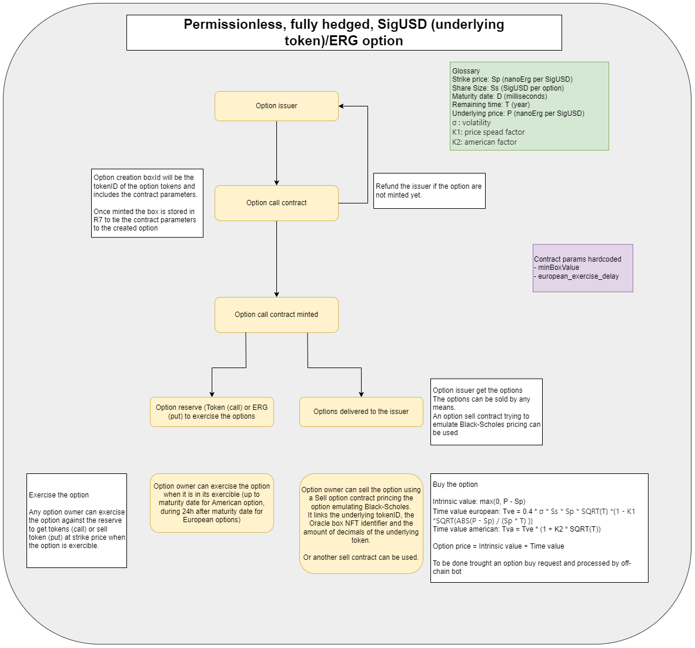

# Sigma'O

- The goal of the project is to provide a smart contract allowing to issue tokens behaving like an option.
- The option type can be CALL or PUT with European or American style.
- The contract is permission less and fully hedged
- A configurable fee for the UI provider is available

## Option Contract
### Option Emission parameters
    - Style: European (exercible during 24h after expiration) or American (exercible up to expiration)
    - Underlying token (for example SigUSD)
    - Option amount: number of option created
    - Share size: number of token per option
    - Strike price: underlying token strike price (nanoerg per token)
    - Maturity date: expiration date of the option, minimum 24h maximum 3 years

### Mint option token
    - The option emission smart contrat allows to create tokens that behaves like an option as they grant to exercise the option from the token stored in the the reserve by the issuer.
    - Once delivered to the issuer, the option tokens are freely tradeable
    - The tokens stored in the reserve are not available for the issuer until the option expiration and the end of the execise period.

## Priced sell option contract
The underlying token needs an Oracle that provides the current price of the token in nanoERG.
### Option pricing
The option price at the money (ATM) is computed with the Black-Scholes approximation formula:
http://www.espenhaug.com/black_scholes.html

    - Strike price: Sp (nanoErg per SigUSD)
    - Share Size: Ss (SigUSD per option)
    - Maturity date: D (milliseconds)
    - Remaining time: T (year)
    - Underlying price: P (nanoErg per SigUSD)
    - σ : volatility
    - K1: price spead factor 
    - K2: american factor

    Option price = intrinsic price + time value
    Call intrinsic price = max(0, (P - Sp) * Ss)
    Put intrinsic price = max(0, (Sp - P) * Ss)
    European option time value = 0.4 * σ * Ss * Sp * SQRT(T) * (1 - K1 * (ABS(P - Sp) / (Sp * SQRT(T)))² )
    American option time value = European option time value * (1 + K2 * SQRT(T))

### Option price behavior
    - At the money Call price = Put Price all parameters equals
    - The time value is maximal at the money and decrease when the underlying price spread from the strike price
    - American option have a price > to the European option with same parameter
    - Max call price = underlying asset price
    - Max put price = strike price
    - Min option price: 0.001 ERG (1000000 nanoergs)
    - Frozen period (cannot be sold anymore)

## Open buy order contract

An open buy order allows to buy an amount of any EIP-4 token at a fixed price, if a seller match the request.

An open buy order makes the box spendable by someone providing the right amount of the requested token to the issuer in the OUTPUTS(1) of the transaction.

A buy order is also refundable at any time for the issuer.

It does not support partial buy and the required token amount needs to be provided.

It can be used by any smart contract to sell an amount of token (EIP-4) to the buy order issuer.

SigmaO uses them to match both fixed price sell or priced option sell orders.

    Parameters:
    - total amount of ERG for the purchase
    - buyer address
    - token id to purchase
    - amount of token to provide (raw amount inclusing decimals)

## Open sell order contract

An open sell order allows to put an amount of token (EIP-4) on sale at a fixed price per token.

An open sell order makes the box spendable by someone providing the right amount of ERG to the issuer in the OUTPUTS(2) of the transaction.

A sell order is also refundable at any time for the issuer.

It supports partial sell.

It can be used by any smart contract to buy an amount of token (EIP-4) to the sell order issuer.

    Parameters:
    - amount of tokens to sell
    - seller address
    - token price (nanoerg per smallest unit of token)

