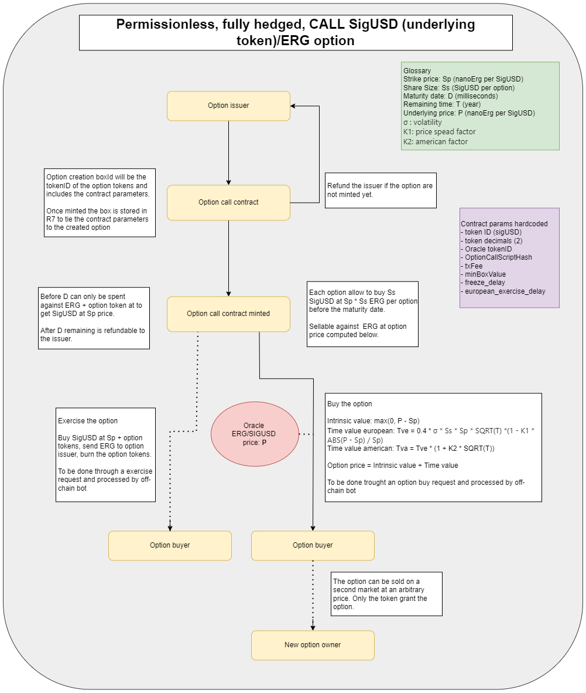

# Sigma'O

- The goal of the project is to provide a smart contract allowing to issue tokens behaving like an option.
- First version only implement CALL option that can be European or American.
- The underlying token needs an Oracle that provides the current price of the token in nanoERG.
- The contract is permission less and fully hedged
- A configurable fee for the UI provider is available

## Option Emission parameters
    - Style: European (exercible during 24h after expiration) or American (exercible up to expiration)
    - Underlying token (for example SigUSD)
    - Option amount: number of option created
    - Share size: number of token per option
    - Strike price: underlying token strike price (nanoerg per token)
    - Maturity date: expiration date of the option, minimum 24h maximum 3 years
    - Sigma: Volatility parameter (bigger increase the price)
    - K1: Spread factor (bigger decrease the price when the spot price is far from the strike price)
    - K2: American factor (bigger increase the price of the American option)

## Mint option token
    - The option emission smart contrat allows to create tokens that behaves like an option as they grant to exercise the option from the token stored in the the reserve by the issuer.
    - Once sold, the tokens are freely tradeable on a secondary market
    - An option sell contract following the same formula with a discount could be implemented.
    - The tokens stored in the reserve are not available for the issuer until the option expiration and the end of the execise period.

## Option call pricing
The option price at the money (ATM) is computed with the Black-Scholes approximation formula:
http://www.espenhaug.com/black_scholes.html

    - Strike price: Sp (nanoErg per SigUSD)
    - Share Size: Ss (SigUSD per option)
    - Maturity date: D (milliseconds)
    - Remaining time: T (year)
    - Underlying price: P (nanoErg per SigUSD)
    - σ : volatility
    - K1: price spead factor 
    - K2: american factor

    Option price = intrinsic price + time value
    intrinsic price = max(0, (P - Sp) * Ss)
    European option time value = 0.4 * σ * Ss * Sp * SQRT(T) *(1 - K1 * ABS(P - Sp) / Sp)
    American option time value = European option time value * (1 + K2 * SQRT(T))

## Option contract hardcoded parameters
    - Underlying token Id
    - Underlying token decimals
    - Oracle token id
    - Min duration: 24h
    - Max duration: 3 years
    - Frozen period (cannot be sold anymore): 4h before expiration
    - European exercise period: 24h

